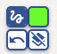

# caMicroscope User Documentation

Welcome to the user documentation for caMicroscope.
* [Setup Installation, and Hosting](#setup-installation-and-hosting) covers getting started with caMicroscope for multiple use cases.
* [Administration](#administration) covers adding slides, users, and configuration to tailor caMicroscope to your application.
* [General Usage](#general-usage) covers using the viewer modes, annotation, and machine learning intergrations.
* [DICOM](#dicom) covers using caMicroscope with DICOM.
* [Links to other Resources](#links-to-other-resources) has links to other useful guides.

## Setup, Installation, and Hosting

### Getting Started

The primary way in which caMicroscope is run is through the distro repository ([https://github.com/camicroscope/distro](https://github.com/camicroscope/distro)). This contains manifests with references to each microservice, as well as the necessary configuration to run caMicroscope. The distro repository contains multiple docker-compose manifests for different deployment needs. The necessary manifest, configuration, and installation is different for development use, local use, or for a web deployment.

### For Development or Personal Use

The develop.yml file ([https://github.com/camicroscope/Distro/blob/master/develop.yml](https://github.com/camicroscope/Distro/blob/master/develop.yml)) is intended for development or personal use. Most notably, this means that all security features are disabled; users do not need to log in to perform any action on the platform. These settings are controlled by the DISABLE_SEC and ALLOW_PUBLIC environment variables under the back/caracal service in develop.yml.

Most services are accessed through back (with the exception of the DICOM server, which has its own optional interface separate to caMicroscope’s UI; see the “Dicom” section of this document). Accessing http://&lt;host location, usually localhost>:4010 should open the caMicroscope user landing page. This port can be configured in back/caracal’s ‘ports’ section in develop.yml.

### For Production

The caMicroscope.yml file is more suited for production, but some additional steps are needed to set up support for security. First, some service, internal or external, needs to support login. This json web key (JWK) should be accessible at a url set to the environment variable “JWK_URL” under the back/caracal service. Correspondingly, a login page should be set up and mounted to ‘/src/static/login.html’ within back/caracal in order to trigger a login with whatever service is needed.

When selecting, an identity provider, note that we expect it to provide a JWT, and to have a certificate/public key/secret which can be used to verify such JWTs.The example given in the Distro within config/login.html is set up to use google as an identity provider. See this guide from google to set up your own project, which is necessary to enable login on your instance.

Alternatively, you can use kc_caMicroscope.yml for a configuration which self-hosts authentication without use of a third party, which is called the “keycloak configuration” named after the service we use.

* Set up Keycloak (covered by docker compose kc_caMicroscope.yml)
    * The URL for this is [http://localhost:8080/admin/master/console/#/](http://localhost:8080/admin/master/console/#/), sub host/port as needed
* Set up realm
    * Add realm called ‘camic’
    * All following steps happen in this realm.
* Set up client
    * Clients -> Add Client
    * Set client_id to camicroscope-test.
    * Openid connect with mostly default settings, but **set client authentication to on**
    * Once saved, Under the credentials tab, get the client secret
    * Add the client secret to config/keycloak_login.html for client_secret.
* Add users
    * Users -> add user
    * Make sure to add an email to match user documents in mongo.
    * Set a password under credentials -> add password

## Administration

### APIs, Route Configuration, and Security

Our backend service, caracal, is designed around a series of modular “handlers” which are executed in sequence and give each api endpoint (or “route”) their properties. The configuration in ./config/routes.json is the default setup. Some handlers, such as the permission handler, are impacted by other environment variables and can thus be globally disabled by setting the “DISABLE_SEC” environment variable flag. Removing a route from this configuration file, or using the disabled route handler in a route, disables the route from any use.

The APIs generally return or accept JSON documents, with notable exceptions for tile server routes.

When security is enabled, a user’s json web token (authentication token) must be included in any request which has been configured with a login handler. 

### Adding Data Directly to the Database

Adding data to the database bypasses all security and route configuration provided by caMicroscope and should be done with caution. By default, the mongodb port is not exposed beyond the caMicroscope subnet, but this can be exposed to another secure subnet if desired. Please do this with caution if at all, as people have lost data to vandalism from this configuration.

More recommended is to use the interactive shell in the ca-mongo container or pod itself. This is done by running `docker exec -it ca-mongo mongo` on the host machine. caMicroscope by default uses a database called `camic`. Use `show collections` to see what document types are available, and use `db.&lt;collection name>.findOne()` to get an example document if one exists. Please see the relevant mongo documentation (https://www.mongodb.com/docs/v3.6/reference/mongo-shell/) for additional guidance of using mongodb. 

### Adding Users

If an instance is secured, users of caMicroscope need a user entry in the ‘user’ collection in mongodb. This must be done with an email matching the sub or email field in the JWT from the authentication provider, including keycloak. Creating the first administrative user allows for subsequent users to be added via the caMicroscope interface (or the /data/user/add api). There are two ways which people typically add the first user: they may disable security and add the user through the signup interface before re-enabling security, or they may add a user directly to mongodb.

 

### Adding Slides

For any slide to be visible in caMicroscope, the Whole Slide Image (WSI) file must exist, and there must be a record in the database to describe it. Both of these can be added simultaneously through the caMicroscope UI.

Follow these steps to add a slide:
1. Navigate to the slides tab in caMicroscope UI
2. From the table, click upload

   

3. Choose a compatible file (svs or DICOM). You can upload a file in three ways:
   1. From your local folder
   2. From your Google drive
   3. Using a URL

The file name and token field should fill automatically.
> Note: If the file name is not automatically filled when you upload the file, you will have to fill it in manually. If this occurs, be sure to add the file extension after the file name, like this _sampleslide.svs_
4. Give the slide a unique name, then click the right-pointing arrow.
5. Click the Finish Upload button 

The same process works for the batch uploader, which can be found as an extended option of the download button from the table.

If the slides are already present, you can use SlideUtil.py within the ca-load container or pod (for docker, use `docker exec -it ca-load`). This requires a manifest of slides which should already exist in the ./images/ (or customized location) filesystem mount. This is useful if you’re working on a system with existing slide images, where you can remap the ./images mount to any location on the host server.

Note that if the file path in the database does not match a file (e.g. if a file is moved or renamed, or if a record is added incorrectly), trying to view the slide in caMicroscope will return an error.

Note that the file location need not be uniquely described in the database; you can make multiple metadata records pointing to the same file, which will separate data products associated with the slide.

### Annotation Template

Annotation data collection can be customized by adding a form to the “template” collection. If multiple templates are present, a user can choose any by name. By default, this template is a name and notes. 

## General Usage

### Viewing

**Navigation and Zooming:**

* **Keyboard Shortcuts:** Utilize WASD or arrow keys for convenient navigation.
* **Click Preview Area:** Instantly navigate to a specific part of the image by clicking on the preview area.
* **Mouse Scroll Wheel:** Scroll to zoom in and out.
* **Touch Controls:** Pinch to zoom and move around the image by dragging your mouse or using touch controls.
* **Zoom Controller:** Utilize buttons, a slider, or directly edit the zoom level number controller for precise adjustments.

**Toolbar Functions:**

* **Layers  :** Access the layers panel to overlay heatmaps, segmentations, saved measurements, and human annotations.
* **Magnifier :** Add a magnified region, bypassing annotations and enhancements.
* **Measurement :** View and save measurements along direct lines or projected onto the x and y axes.
* **Enhance :** Apply image transformations for enhanced investigation.
* **Share View :** Generate a link to share the current slide position, zoom, and active layers.
* **Side-by-Side :** Split the viewing area into two views with different layers or enhancements. Control zoom levels independently.
* **Heatmap :** Navigate to the Heatmap Viewer for specialized analysis, provide feedback on false positive and negative areas of a heatmap.
* **Segmentation  and Prediction/Classification :** Open viewers for computer vision and machine learning tools (covered in the "Machine Learning Tools" section).
* **Slide Capture :** Download the current view as a JPEG file.

### Annotation

**Annotation:**

Click the annotation icon   to open the annotation panel. This action changes the mouse mode in the main viewer area to draw once and then save.

**Single Drawing Mode:**

* Before drawing, provide a name for the annotation.
* Fill out the configured form for the caMicroscope deployment (refer to the "Annotation Template" in the Administration section for form customization details).
* An annotation is automatically saved once drawn in this mode.

**Multiple Drawing Mode:**

* Click the annotation icon a second time to switch to this mode.
* Draw multiple shapes with the same form data.
* Save the annotations by clicking the “save” button in the annotation panel.

The drawing mode is visually indicated:

*  for single drawing mode.
*  for multiple drawing mode.

**During Drawing:**

* **Color and Drawing Mode:** Right-click (or long press with touch controls) to open a menu . Adjust the color or drawing mode during the annotation process.
* **Drawing Modes:** By default, the drawing mode is freehand. Change it to a rectangle, point annotation, or a polygon of connected points.

### Using Preset Labels

**Preset Label Annotation Mode:**

For workflows requiring more control and speed, caMicroscope offers a preset labeling mode. Click the preset label icon  to access a list of presets, each configured with predefined attributes. This feature streamlines the annotation process:

**Selecting a Preset:**

* Click the preset label icon to open a list of presets.
* Choose a preset to automatically set the color, viewer mode, and form data for annotation.
* In addition to all shape types from annotation, a "BRUSH" drawing mode is added as an option for preset labels which creates squares of a predefined size on a fixed grid, providing an efficient way to "paint" the annotation.

**Creating Label Types:**

* To add a label type, set the name, color, and shape (drawing mode) for the preset.
* Assign an unused keyboard shortcut key combination with control for quicker annotation.

This streamlined approach enhances annotation efficiency, allowing for rapid and controlled labeling. Explore preset label annotation to optimize your workflow.

## **Machine Learning Tools**

### Adding a Model

To use a machine learning model in caMicroscope, it must be added to the app in which it is meant to be used. To export a pre-trained model for use with caMicroscope, use the tfjs export format (see[ TensorFlow.js Guide](https://www.tensorflow.org/js/guide/conversion) for a guide for this export).

To add a model, go to the application (segmentation or classification) which matches the model, and click the “add” button.

In the model add menu, give the model a descriptive name, information on how the model was trained as relevant to the image segmentation or classification tasks, that is the patch size in pixels, the magnification level, and whether the images were RGB or grayscale. For classification, add human-readable labels for the classes (importantly, make sure that these are in the correct order to match the model, or the results will read incorrectly). Then either upload or provide a link to the model.json and weight binaries.

Models are saved in the browser’s local storage and are not uploaded to the server. It is thus required to upload the model for each device or browser used.

Information for the uploaded models can be found by clicking the model information icon on either the segmentation or classification application.

A selection of pre-trained caMicroscope compatible machine learning models are provided at[ caMicroscope/tfjs-models](https://github.com/camicroscope/tfjs-models/).

### Using Models in The Main Viewer

The “smart pens” feature can use either computer vision or a segmentation model to enhance segmentation by following contours.

### Segmentation Application

The segmentation button  in the main viewer toolbar opens the segmentation mode. Click the segmentation icon in this application to change the interaction mode to draw a region on which to compute segmentation. By default, this uses openCV’s edge detection, but this or any uploaded model can be selected by the model selection dropdown. These results can be given a name and notes and saved as an annotation if desired.

### Classification/Prediction Application

The predict button  in the main viewer toolbar opens prediction mode, which can be used to classify or predict regions of an image. Select a model using the model selection dropdown, then click the predict icon in this application to draw a region and have the model return a classification/prediction.

### Workbench (Creating a Model)

From the table view, click “Workbench” in the top bar to open the model creation and training workbench. This application is a wizard to add and tweak layers for a model and train against labeling datasets. Data for these datasets can be created with the “labeling” mode from the main viewer’s toolbar.

## Dicom

caMicroscope seamlessly integrates with DICOM servers, providing a convenient way to access and review pathology images. By default, caMicroscope is configured to connect to the Orthanc DICOM server, which is accessible on port 8042.

### Accessing the Orthanc DICOM Server

To access the Orthanc DICOM server, navigate to the designated port (e.g., http://your-server-address:8042) in your web browser. This allows you to interact with DICOM images stored on the server.

### Adding Pathology Images

Adding DICOM pathology images to the Orthanc DICOM server automatically incorporates them into caMicroscope for detailed review. The integration streamlines the workflow, ensuring that relevant images are readily available for analysis within the caMicroscope environment.

## Links to other Resources

Website: [https://camicroscope.github.io/](https://camicroscope.github.io/)

Community Guide: [https://camicroscope.github.io/community.html](https://camicroscope.github.io/community.html)

Contributing Guide: [https://camicroscope.github.io/contributing.html](https://camicroscope.github.io/contributing.html) 

Code of Conduct: [https://camicroscope.github.io/conduct.html](https://camicroscope.github.io/conduct.html) 

Discussion Board (new): [https://github.com/orgs/camicroscope/discussions](https://github.com/orgs/camicroscope/discussions) 

Github: [https://github.com/caMicroscope](https://github.com/caMicroscope) 

**[Improve this guide by submitting feedback!](https://github.com/camicroscope/docs/issues/new/choose)** 

